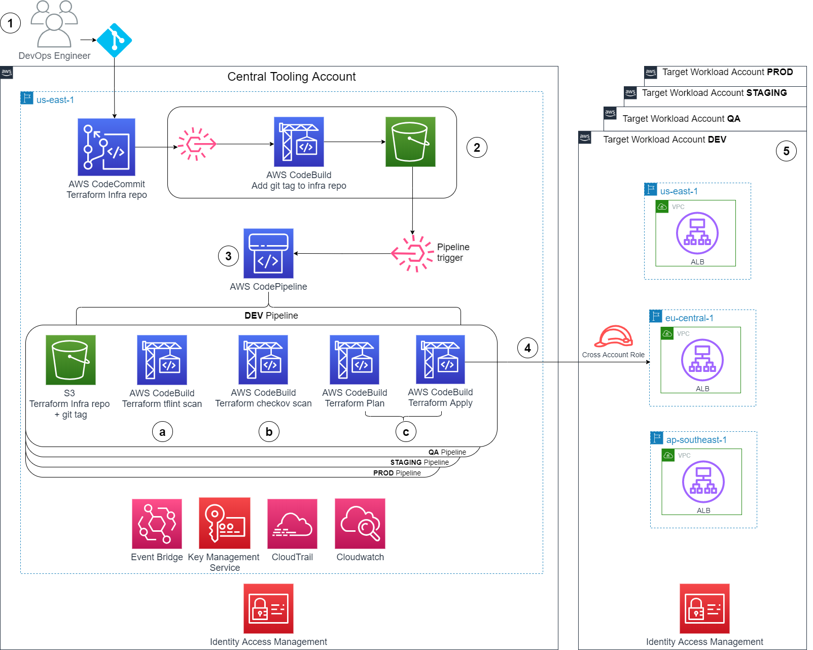
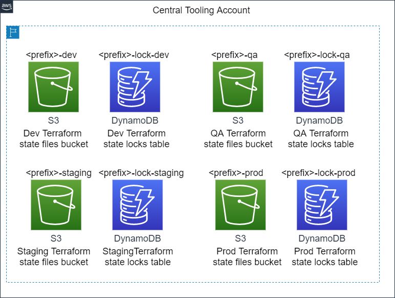
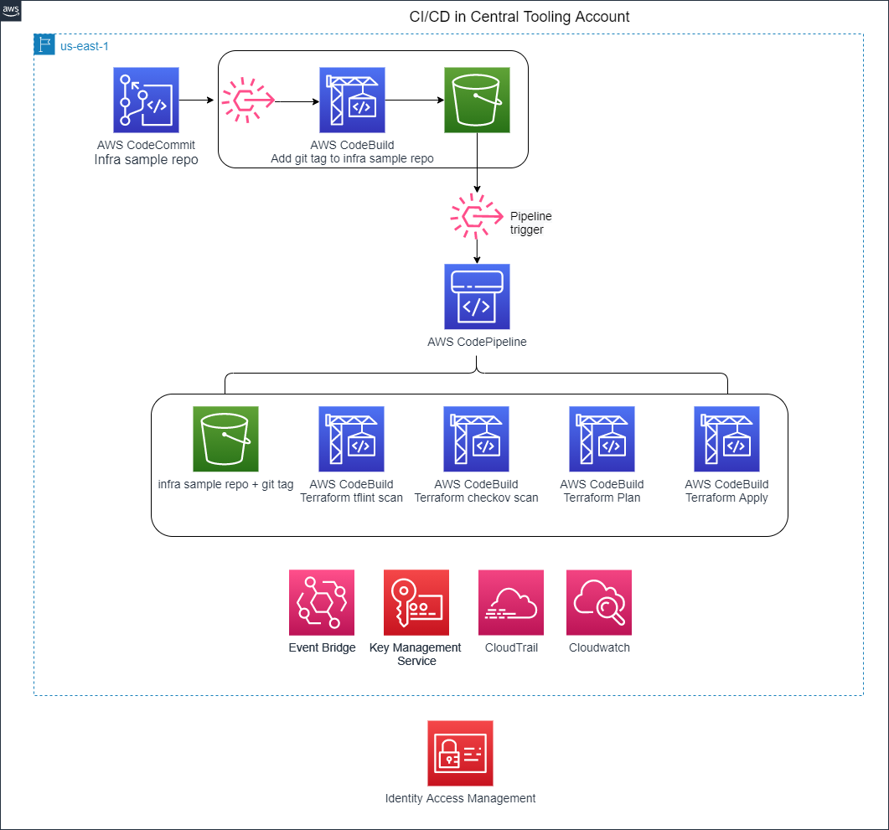
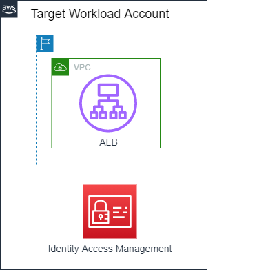
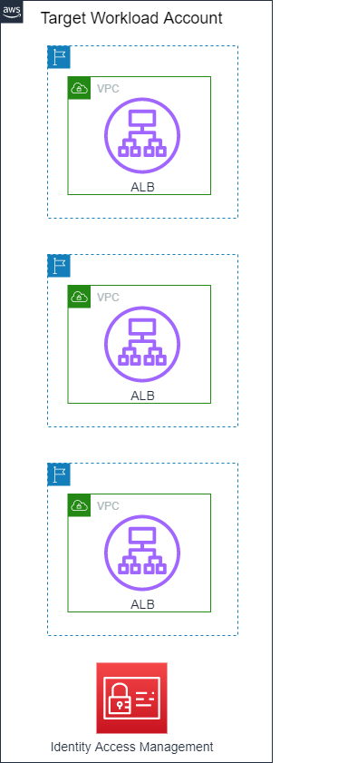

# aws-multi-region-cicd-with-terraform

A multi region CI/CD pipeline with AWS CodePipeline and AWS CodeBuild in Terraform

## Table of contents
* [Overall architecture](#overall-architecture)
* [Instructions to deploy the CI/CD pipeline](#instructions-to-deploy-the-cicd-pipeline)
   * [Step 1: Prerequisites](#step-1-prerequisites)
   * [Step 2: Deploy CI/CD pipeline resources in the central tooling account](#step-2-deploy-cicd-pipeline-resources-in-the-central-tooling-account)
   * [Step 3: Push the infra repo code into AWS CodeCommit in the central tooling account](#step-3-push-the-infra-repo-code-into-aws-codecommit-in-the-central-tooling-account)
* [Kick off a pipeline to deploy to a target workload account and a target region](#kick-off-a-pipeline-to-deploy-to-a-target-workload-account-and-a-target-region)
  * [Examples](#examples)
     * [Dev pipeline](#dev-pipeline)
     * [QA pipeline](#qa-pipeline)
     * [Staging pipeline](#staging-pipeline)
     * [Prod pipeline](#prod-pipeline)
* [Instructions to destroy resources](#instructions-to-destroy-resources)
   * [Step 1: Destroy the resources in the target workload account(s)](#step-1-destroy-the-resources-in-the-target-workload-accounts)
   * [Step 2: Destroy the resources in the central tooling account created in this repo](#step-2-destroy-the-resources-in-the-central-tooling-account-created-in-this-repo)
   * [Step 3: Destroy the Terraform state resources](#step-3-destroy-the-terraform-state-resources)
* [Common Errors or Warnings](#common-errors-or-warnings)
* [Security](#security)
* [License](#license)

 
## Overall Architecture
This is what we will build.
* First we create the CI/CD resources inside the Central Tooling account using Terraform.
* Next we will use the pipeline created as part of the CI/CD resources to deploy the sample infra into the target workload account.
* Below is the overall architecture.



## Instructions to deploy the CI/CD pipeline
## Step 1: Prerequisites
To follow this sample you will need:
* [Terraform CLI (0.14+)](https://www.terraform.io/downloads) installed.
* [AWS CLI](https://docs.aws.amazon.com/cli/latest/userguide/install-cliv2.html) installed.
* [AWS account](https://aws.amazon.com/free) for the central tooling account for CI/CD and [associated credentials](https://docs.aws.amazon.com/general/latest/gr/aws-sec-cred-types.html#access-keys-and-secret-access-keys) that allow you to create resources in this account.
* [AWS account](https://aws.amazon.com/free) for the target workload account where you deploy sample infra resources and [associated credentials](https://docs.aws.amazon.com/general/latest/gr/aws-sec-cred-types.html#access-keys-and-secret-access-keys) that allow you to create resources in this account.
* Next, create IAM resources in the central tooling account using below:
```shell
chmod +x ./scripts/prerequisites/*
./scripts/prerequisites/create-iam-resources_for_tooling_account.sh
```

#### Terraform Remote State Management
* Use `aws configure` with your IAM user credentials for the central tooling account and then assume InfraBuildRole:
```shell
# You can use below one liner
# For details, see [this](https://aws.amazon.com/premiumsupport/knowledge-center/iam-assume-role-cli/
# Update 111122223333 below to your central tooling account number
OUT=$(aws sts assume-role --role-arn arn:aws:iam::111122223333:role/InfraBuildRole --role-session-name INFRA_BUILD);export AWS_ACCESS_KEY_ID=$(echo $OUT | jq -r '.Credentials''.AccessKeyId');export AWS_SECRET_ACCESS_KEY=$(echo $OUT | jq -r '.Credentials''.SecretAccessKey');export AWS_SESSION_TOKEN=$(echo $OUT | jq -r '.Credentials''.SessionToken');

# Verify you assumed the role
aws sts get-caller-identity
{
    "UserId": "AAA:INFRA_BUILD",
    "Account": "111122223333",
    "Arn": "arn:aws:sts::111122223333:assumed-role/InfraBuildRole/INFRA_BUILD"
}
```
* Create terraform remote state management resources preferably in the same region you plan to use for your CI/CD resources:
* Create S3 buckets per environment with name `"<tf_backend_config_prefix>-<env>"` and DynamoDB tables for state locks with name `"<tf_backend_config_prefix>-lock-<env>"` 
   * env is one of (dev, qa, staging, prod) or it can be configured as a list of tags you have passed as input param in tag_prefix_list.  
   * tf_backend_config_prefix is a name of your choice that's globally unique in S3. See https://github.com/cloudposse/terraform-aws-tfstate-backend#input_namespace
   * Make a note of this value.You will then pass this tf_backend_config_prefix value to each script using -b <tf_backend_config_prefix>.
   * Below is an example on how to create terraform remote state resources along with **a valid provider config**. For more details including on input params, pls see [this](https://registry.terraform.io/modules/cloudposse/tfstate-backend/aws/latest).  
   * You'd then perform the usual terraform init, terraform plan and apply.
```hcl
locals {
  # namespace = "<your-unique-namespace-without-brackets>" # For example:
  namespace = "org-awesome-tf-state" # This is the tf_backend_config_prefix. Pick a namespace that's globally unique in S3.  See https://github.com/cloudposse/terraform-aws-tfstate-backend#input_namespace
  environment_list = ["dev", "qa", "staging", "prod"]
}

module "terraform_state_backend" {
  for_each            = toset(local.environment_list)
  source              = "github.com/cloudposse/terraform-aws-tfstate-backend?ref=0.38.1"
  namespace           = local.namespace 
  stage               = each.key
  dynamodb_table_name = "${local.namespace}-lock-${each.key}"

  terraform_backend_config_file_path = "."
  terraform_backend_config_file_name = "backend.tf"
  force_destroy                      = false
}

provider "aws" {
  region = "<enter-your-cicd-region-here-without-brackets>"
}
```
* This will create the following where the value of the prefix is set to the namespace. This is the tf_backend_config_prefix ("org-awesome-tf-state" in our example)


## CI/CD
* First we will create the CI/CD resources.  To do this, we use Terraform locally.
   * We need to first create CI/CD resources in the central tooling account so we can use them to deploy the sample infrastructure workload to the target workload account using the pipeline.
   * Since there are no CI/CD resources yet in the central tooling account and we need to create them, we create them with Terraform.  Below is what we will create.



### Step 2: Deploy CI/CD pipeline resources in the central tooling account
* Clone this repo into your local shadow. 
* Scripts are under ./scripts directory and are expected to be run from the root directory of this project.
  * Make sure to `chmod +x scripts/*` 
* Update environments/prod/tooling/variables.tfvars with the input parameter values of your choice as listed in the next section under "Inputs".  
  * account is mandatory and it should be set to the account number of your central tooling account.  
  * target_accounts is mandatory and, it should be set to the account numbers of your workload accounts.  
       ```hcl 
       account=111122223333 # This is required to deploy the CI/CD resources in the central tooling account that you created
       target_accounts=["555555555555", "444455556666"] # This is required for entitling AWS CodeBuild to assume the Cross Account IAM role in the target workload accounts.
       tag_prefix_list=["dev", "qa", "staging", "prod"] # Optional. Update to the environment names of your choice, otherwise this is the default list of environments that are also the git tag prefixes for deployments.
       number_of_azs=3 # Optional. Set to the number of az's to deploy CI/CD resources.  Otherwise, it defaults to 3.
       ```
* Use `aws configure` with your IAM user credentials for the central tooling account and then assume InfraBuildRole:
```shell
# You can use below one liner
# For details, see [this](https://aws.amazon.com/premiumsupport/knowledge-center/iam-assume-role-cli/
# Update 111122223333 below to your central tooling account number
OUT=$(aws sts assume-role --role-arn arn:aws:iam::111122223333:role/InfraBuildRole --role-session-name INFRA_BUILD);export AWS_ACCESS_KEY_ID=$(echo $OUT | jq -r '.Credentials''.AccessKeyId');export AWS_SECRET_ACCESS_KEY=$(echo $OUT | jq -r '.Credentials''.SecretAccessKey');export AWS_SESSION_TOKEN=$(echo $OUT | jq -r '.Credentials''.SessionToken');

# Verify you assumed the role
aws sts get-caller-identity
{
    "UserId": "AAA:INFRA_BUILD",
    "Account": "111122223333",
    "Arn": "arn:aws:sts::111122223333:assumed-role/InfraBuildRole/INFRA_BUILD"
}
```
* There is an order we follow for the deployment.  We create the global resources first, followed by regional resources. This is because some global resources (i.e. IAM roles) are looked up by the regional resources.
* First run the script to generate the tf plan for global resources (i.e. IAM resources for CodeBuild/CodePipeline), inspect the plan and then run `terraform apply "tfplan"`: 
```shell
./scripts/run-tf-prod-global.sh -b <tf_backend_config_prefix>
# Ex: ./scripts/run-tf-prod-global.sh -b unique-namespace-for-tf-state-created-in-prereqs
#Note: If you are using a region other than us-east-1 for CI/CD tooling, also set -r param (similarly if you use a region other than us-east-1 to deploy global resources from, then pass -g param) 
#For ex: ./scripts/run-tf-prod-global.sh -b org-awesome-tf-state -g eu-central-1 -r eu-central-1
# check the plan and then run:
terraform apply "tfplan"
```
* You should see the following along with the usual warning around using -target option.
```shell
  ╷
  │ Warning: Applied changes may be incomplete
  │
  │ The plan was created with the -target option in effect, so some changes requested in the configuration may have been ignored and the output values may not be fully updated. Run the following command to verify that no other changes are pending:
  │     terraform plan
  │
  │ Note that the -target option is not suitable for routine use, and is provided only for exceptional situations such as recovering from errors or mistakes, or when Terraform specifically suggests to use it as part of an error message.
  ╵
  Releasing state lock. This may take a few moments...

Apply complete! Resources: 5 added, 0 changed, 0 destroyed.
```

* Run the script to generate the tf plan for regional resources (VPC, CodeBuild, CodePipeline, CodeCommit, etc. resources), inspect the plan and then run `terraform apply "tfplan"`: 
```shell
./scripts/run-tf-prod.sh -b <tf_backend_config_prefix>
# Ex: ./scripts/run-tf-prod.sh -b unique-namespace-for-tf-state-created-in-prereqs
#Note: If you are using a region other than us-east-1 for CI/CD tooling, also set -r param
#For ex: ./scripts/run-tf-prod-global.sh -b org-awesome-tf-state -r eu-central-1
# check the plan and then run:
terraform apply "tfplan"
```
* You will see a message like following for the plan:
```shell
[..]
Plan: 80 to add, 0 to change, 0 to destroy.
[..]
```
* You will see a message like following after apply including the usual warning about using -target:
```shell
╷
│ Warning: Applied changes may be incomplete
│
│ The plan was created with the -target option in effect, so some changes requested in the configuration may have been ignored and the output values may not be fully updated. Run the following command to verify that no other changes are pending:
│     terraform plan
│
│ Note that the -target option is not suitable for routine use, and is provided only for exceptional situations such as recovering from errors or mistakes, or when Terraform specifically suggests to use it as part of an error message.
╵
Releasing state lock. This may take a few moments...

Apply complete! Resources: 80 added, 0 changed, 0 destroyed.
```
* You just created the CI/CD resources in your central tooling account!
* Next, please see the section [to push the infra repo code into AWS CodeCommit in the central tooling account](#step-3-to-push-the-infra-repo-code-into-aws-codecommit-in-the-central-tooling-account)

## Sample infra workload
Below is the sample infrastructure workload that we will deploy using the pipeline to the target workload account.
Here we are showing only a single region deployment.



Here is what it looks like after the same sample infrastructure workload is deployed to multiple regions using the pipeline.



### Prerequisite
* Create IAM resources in the workload account using below:
```shell
./scripts/prerequisites/create-iam-resources_for_workload_account.sh
```

* We created the AWS CodeCommit repository till now but it is empty. Next we need to push the sample infra Terraform code into the AWS CodeCommit repo.
### Step 3: Push the infra repo code into AWS CodeCommit in the central tooling account
* Use `aws configure` with your IAM user credentials for the central tooling account and then assume CloudOps role:
```shell
# You can use below one liner
# For details, see [this](https://aws.amazon.com/premiumsupport/knowledge-center/iam-assume-role-cli/
# Update 111122223333 below to your central tooling account number
OUT=$(aws sts assume-role --role-arn arn:aws:iam::111122223333:role/CloudOps --role-session-name CLOUD_OPS);export AWS_ACCESS_KEY_ID=$(echo $OUT | jq -r '.Credentials''.AccessKeyId');export AWS_SECRET_ACCESS_KEY=$(echo $OUT | jq -r '.Credentials''.SecretAccessKey');export AWS_SESSION_TOKEN=$(echo $OUT | jq -r '.Credentials''.SessionToken');

# Verify you assumed the role
aws sts get-caller-identity
{
    "UserId": "AAA:INFRA_BUILD",
    "Account": "111122223333",
    "Arn": "arn:aws:sts::111122223333:assumed-role/CloudOps/CLOUD_OPS"
}
```
* Git clone the sample infra code at the repo [aws-sample-infra-resources-terraform](https://github.com/aws-samples/aws-sample-infra-resources-terraform) into your local shadow.
* Update `environments/<env>/<team>/variables.tfvars` per env and team.  
   * If you prefer to use different team names, be sure to update the team folder names.  
   * Similarly if you prefer to use diff environment names, be sure to update the env folder names.  These should match the tag_prefix_list in aws-multi-region-cicd-with-terraform repo.
   * Mandatory: Update the `account` number with the corresponding target workload account number.
   * Optionally, update `number_of_azs` in variables.tfvars.  Otherwise it defaults to 2.
       * You can also set the value in each region's `<region>.tfvars` if you prefer to set it differently for a region (including any other region specific input params values though this may result in config drift and is not recommended.  Please see accompanying blog post on recommendations.)
* Go to AWS CodeCommit in the console of the central tooling account -> Repositories -> "awsome-infra-project" and copy the git clone url (HTTPS GRC) under "Clone URL"
* Add the AWS CodeCommit remote repo as git remote with name "codecommit".  If you name the remote repo differently then make sure to use the same name in the next step!
```shell
git remote add codecommit <enter-https-grc-clone-url-here-without-brackets>
Ex:
git remote add codecommit codecommit::us-east-1://awsome-infra-project
```
* Please be sure to push to the **"main"** branch in the "codecommit" remote repo as that's the **branch we use in the sample** unless you had set the default branch name using default_branch input param:
```shell
git push codecommit <curr_branch>:main # make sure to update curr_branch to the name of your current branch
# Ex: git push codecommit feature-123:main # if you named your remote repo other than "codecommit", ensure to use the same name here
```
* Go to AWS CodeCommit in the console of the central tooling account -> Repositories -> "awsome-infra-project". You should see the infra code under Repositories -> Code in "main" branch.
* For future updates, you can make your changes in the repo as needed and tag to deploy.

Now we can deploy the sample infra to the target workload account using a pipeline.
### Kick off a pipeline to deploy to a target workload account and a target region
* Use `aws configure` with your IAM user credentials for the central tooling account and then assume CloudOps role:
```shell
# You can use below one liner
# For details, see [this](https://aws.amazon.com/premiumsupport/knowledge-center/iam-assume-role-cli/
# Update 111122223333 below to your central tooling account number
OUT=$(aws sts assume-role --role-arn arn:aws:iam::111122223333:role/CloudOps --role-session-name CLOUD_OPS);export AWS_ACCESS_KEY_ID=$(echo $OUT | jq -r '.Credentials''.AccessKeyId');export AWS_SECRET_ACCESS_KEY=$(echo $OUT | jq -r '.Credentials''.SecretAccessKey');export AWS_SESSION_TOKEN=$(echo $OUT | jq -r '.Credentials''.SessionToken');

# Verify you assumed the role
aws sts get-caller-identity
{
    "UserId": "AAA:INFRA_BUILD",
    "Account": "111122223333",
    "Arn": "arn:aws:sts::111122223333:assumed-role/CloudOps/CLOUD_OPS"
}
```
* Go to your local shadow of the [aws-sample-infra-resources-terraform](https://github.com/aws-samples/aws-sample-infra-resources-terraform) repo.  See examples in the next section and details below.
* Typically, if there are global resource(s) required by regional resources, then you'll need to kick off the global resource pipeline once for the account first so they are available ahead of the regional deployments targeting that same account.
   * Global resources are deployed once per account.  Regional resources are deployed once per region in the account.
* First deploy global resources by git tagging the AWS CodeCommit repo with the `<env>_global/<team>/<version>` (env can be one of (dev, qa, staging, prod) or what you set in tag_prefix_list as per previous instructions and team can be one of (risk ,research) or what you set as per previous instructions as defined in the infra repo environments config.
* Git tag the AWS CodeCommit repo with the `<env>_<region>/<team>/<version>` (env can be one of (dev, qa, staging, prod) or what you set in tag_prefix_list as per previous instructions and team can be one of (risk ,research) or what you set as per previous instructions as defined in the infra repo environments config.
* Below is what happens when you git tag the AWS CodeCommit repo:
   * The git tagging first kicks off the respective `<env>-awsome-infra-project-src` AWS CodeBuild project that adds the git tag along with full clone of the repo into an S3 source bucket.  
   * This triggers the AWS CodePipeline pipeline named `<env>-awsome-infra-project-deploy` for this environment.  The pipeline performs the deployment once you approve after each manual approval step.  For full details, please also see the accompanying blog post.
   * You can see the tags created under Repository -> Git tags.
   * You can see the running CodeBuild job logs under Build -> Build Projects -> Click on the job -> Build History tab -> Click on Build run -> Build Logs tab
#### Examples:
##### Dev pipeline:
* Global resources for research dev account:
```shell
TAG=dev_global/research/1.0; git tag -a $TAG -m "Deploying $TAG"; git push codecommit $TAG
```
* Regional resources for research dev account: 
```shell
TAG=dev_us-east-1/research/1.0; git tag -a $TAG -m "Deploying $TAG"; git push codecommit $TAG
TAG=dev_eu-central-1/research/1.0; git tag -a $TAG -m "Deploying $TAG"; git push codecommit $TAG
TAG=dev_ap-southeast-1/research/1.0; git tag -a $TAG -m "Deploying $TAG"; git push codecommit $TAG
```
* Global resources for risk dev account: 
```shell
TAG=dev_global/risk/1.2; git tag -a $TAG -m "Deploying $TAG"; git push codecommit $TAG
```
* Regional resources:
```shell
TAG=dev_eu-central-1/risk/1.2; git tag -a $TAG -m "Deploying $TAG"; git push codecommit $TAG
```
##### QA pipeline:
* Global resources for research qa account: 
```shell 
TAG=qa_global/research/1.0; git tag -a $TAG -m "Deploying $TAG"; git push codecommit $TAG
```
* Regional resources: 
```shell
TAG=qa_us-east-1/research/1.0; git tag -a $TAG -m "Deploying $TAG"; git push codecommit $TAG
```
* Global resources for risk qa account: 
```shell
TAG=qa_global/risk/1.2; git tag -a $TAG -m "Deploying $TAG"; git push codecommit $TAG
```
* Regional resources: 
```shell
TAG=qa_eu-central-1/risk/1.2; git tag -a $TAG -m "Deploying $TAG"; git push codecommit $TAG
```
##### Staging pipeline:
* Global resources for research staging account: 
```shell
TAG=staging_global/research/1.0; git tag -a $TAG -m "Deploying $TAG"; git push codecommit $TAG
```
* Regional resources: 
```shell
TAG=staging_us-east-1/research/1.0; git tag -a $TAG -m "Deploying $TAG"; git push codecommit $TAG
```
* Global resources for risk staging account: 
```shell
TAG=staging_global/risk/1.2; git tag -a $TAG -m "Deploying $TAG"; git push codecommit $TAG
```
* Regional resources: 
```shell
TAG=staging_eu-central-1/risk/1.2; git tag -a $TAG -m "Deploying $TAG"; git push codecommit $TAG
```
##### Prod pipeline:
* Global resources for research prod account: 
```shell
TAG=prod_global/research/1.0; git tag -a $TAG -m "Deploying $TAG"; git push codecommit $TAG
```
* Regional resources: 
```shell
TAG=prod_us-east-1/research/1.0; git tag -a $TAG -m "Deploying $TAG"; git push codecommit $TAG
```
* Global resources for risk prod account: 
```shell
TAG=prod_global/risk/1.2; git tag -a $TAG -m "Deploying $TAG"; git push codecommit $TAG
```
* Regional resources: 
```shell
TAG=prod_eu-central-1/risk/1.2; git tag -a $TAG -m "Deploying $TAG"; git push codecommit $TAG
```

## Instructions to destroy resources
* Order matters here.  Perform in below order!

### Step 1: Destroy the resources in the target workload account(s)
## Prerequisites
* Use `aws configure` with your IAM user credentials for the central tooling account and then assume InfraBuildRole:
```shell
# You can use below one liner
# For details, see [this](https://aws.amazon.com/premiumsupport/knowledge-center/iam-assume-role-cli/
OUT=$(aws sts assume-role --role-arn arn:aws:iam::111122223333:role/InfraBuildRole --role-session-name INFRA_BUILD);export AWS_ACCESS_KEY_ID=$(echo $OUT | jq -r '.Credentials''.AccessKeyId');export AWS_SECRET_ACCESS_KEY=$(echo $OUT | jq -r '.Credentials''.SecretAccessKey');export AWS_SESSION_TOKEN=$(echo $OUT | jq -r '.Credentials''.SessionToken');

# Verify you assumed the role
aws sts get-caller-identity
{
    "UserId": "AAA:INFRA_BUILD",
    "Account": "111122223333",
    "Arn": "arn:aws:sts::111122223333:assumed-role/InfraBuildRole/INFRA_BUILD"
}
```
* See the README for the sister repo [aws-sample-infra-resources-terraform](https://github.com/aws-samples/aws-sample-infra-resources-terraform) to destroy the sample infra workload resources in the target workload account(s)
* Ensure all resources created by the sample in the target workload account(s) in each region are destroyed prior to proceeding to the next step.

### Step 2: Destroy the resources in the central tooling account created in this repo
* As InfraBuildRole in the central tooling account, **perform the following in below order**:
* To destroy regional resources, first run the script `./scripts/run-tf-prod-destroy.sh` passing in args as needed and inspect the tf plan.  Then run `terraform apply "tfplan"`
```shell
./scripts/run-tf-prod-destroy.sh -t <tag> -b <tf_backend_config_prefix> -r <tf_state_region> -g <global_resource_deployment_region>
# Ex: ./scripts/run-tf-prod-destroy.sh -t prod_us-east-1/tooling/1.0 -b org-awesome-tf-state -r us-east-1 -g us-east-1
```
* Then, to destroy global resources, run the script `./scripts/run-tf-prod-global-destroy.sh` passing in args as needed and inspect the tf plan.  Then run `terraform apply "tfplan"`
```shell
./scripts/run-tf-prod-global-destroy.sh -t <tag> -b <tf_backend_config_prefix> -r <tf_state_region> -g <global_resource_deployment_region>
# Ex: ./scripts/run-tf-prod-global-destroy.sh -t prod_global/tooling/1.0 -g eu-central-1 -r eu-central-1 -b org-awesome-tf-state
```
### Step 3: Destroy the Terraform state resources
* Please proceed with caution! You will need the Terraform state resources for above 2 sections ([to destroy central tooling](#step-2-destroy-the-resources-in-the-central-tooling-account-created-in-this-repo) and [target workload resources](#step-1-destroy-the-resources-in-the-target-workload-accounts) created by these sample projects).  Do not destroy Terraform remote state resources until after you are done with both!
* The S3 buckets for Terraform state and DynamoDB Tables for Terraform state locks you created on your end outside of these sample projects in your central tooling account, also would need to be deleted by you if you no longer need any Terraform state files stored in them.

### Step 4: Destroy the IAM roles InfraBuildRole, CloudOps and AWS accounts
* Now you can destroy the IAM roles created as part of the prerequisites: InfraBuildRole, CloudOps in the central tooling account and InfraBuildRole in the target workload account.
* If you created them solely for this sample, you can also destroy the AWS accounts you used for this sample.

### Common Errors or Warnings
* If you see below error, you are hitting the number of concurrent builds limit in your account.  Check all the CodeBuild builds that are in progress to confirm and proceed accordingly.
```
Action execution failed
Error calling startBuild: Cannot have more than 1 builds in queue for the account (Service: AWSCodeBuild; Status Code: 400; Error Code: AccountLimitExceededException; Request ID: XXX; Proxy: null)
```
* If you tag multiple times in quick succession that may result in multiple pipeline executions queuing up for the same pipeline stage (say Terraform Build), this then would cause waiting executions that get superseded by more recent executions of the pipeline.
   * You can see pipelines history to see which executions got superseded at `https://console.aws.amazon.com/codesuite/codepipeline/pipelines/<env>-awsome-infra-project-deploy/executions?region=us-east-1`
   * For more details, please also see: https://docs.aws.amazon.com/codepipeline/latest/userguide/concepts-how-it-works.html -> Rule 3
   * You can instead have a pipeline per env, team and region such that the executions are for the same account and region at all times.
* Because we are using -target, you will see below warning as expected:
```
  │ Warning: Applied changes may be incomplete
  │
  │ The plan was created with the -target option in effect, so some changes requested in the configuration may have been ignored and the output values
  │ may not be fully updated. Run the following command to verify that no other changes are pending:
  │     terraform plan
  │
  │ Note that the -target option is not suitable for routine use, and is provided only for exceptional situations such as recovering from errors or
  │ mistakes, or when Terraform specifically suggests to use it as part of an error message.
```
* When you first deploy the pipelines, they all run by default and because there is nothing in S3 source bucket, they show as "Failed" in the console.  This behavior of pipelines running at first deployment is as expected so you can safely ignore this.
* tflint output junit report is empty when tflint is successful.  Due to this, we see a NaN report in CodeBuild report tab when tflint is successful as per the log output.

## Security

See [CONTRIBUTING](CONTRIBUTING.md#security-issue-notifications) for more information.

## License

This library is licensed under the MIT-0 License. See the LICENSE file.

<!-- BEGIN_TF_DOCS -->
## Requirements

| Name | Version |
|------|---------|
| <a name="requirement_terraform"></a> [terraform](#requirement\_terraform) | > 0.14 |
| <a name="requirement_aws"></a> [aws](#requirement\_aws) | ~> 3.74 |

## Providers

| Name | Version |
|------|---------|
| <a name="provider_aws"></a> [aws](#provider\_aws) | 3.74.0 |

## Modules

| Name | Source | Version |
|------|--------|---------|
| <a name="module_global"></a> [global](#module\_global) | ./modules/global | n/a |
| <a name="module_regional"></a> [regional](#module\_regional) | ./modules/regional | n/a |

## Resources

| Name | Type |
|------|------|
| [aws_caller_identity.current](https://registry.terraform.io/providers/hashicorp/aws/latest/docs/data-sources/caller_identity) | data source |
| [aws_region.current](https://registry.terraform.io/providers/hashicorp/aws/latest/docs/data-sources/region) | data source |

## Inputs

| Name | Description | Type | Default | Required |
|------|-------------|------|---------|:--------:|
| <a name="input_account"></a> [account](#input\_account) | Target AWS account number | `number` | n/a | yes |
| <a name="input_codebuild_artifacts_prefix"></a> [codebuild\_artifacts\_prefix](#input\_codebuild\_artifacts\_prefix) | A prefix for S3 bucket name to house the AWS CodeBuild artifacts for cache, etc. | `string` | `"awsome-cb-artifact"` | no |
| <a name="input_codepipeline_artifacts_prefix"></a> [codepipeline\_artifacts\_prefix](#input\_codepipeline\_artifacts\_prefix) | A prefix for S3 bucket name to house the AWS CodePipeline artifacts for cache, etc. | `string` | `"awsome-cp-artifact"` | no |
| <a name="input_env"></a> [env](#input\_env) | Environment name | `string` | `"dev"` | no |
| <a name="input_global_resource_deploy_from_region"></a> [global\_resource\_deploy\_from\_region](#input\_global\_resource\_deploy\_from\_region) | Region from which to deploy global resources in our pipeline | `string` | `"us-east-1"` | no |
| <a name="input_number_of_azs"></a> [number\_of\_azs](#input\_number\_of\_azs) | Number of azs to deploy to | `number` | `3` | no |
| <a name="input_region"></a> [region](#input\_region) | Target region | `string` | `"us-east-1"` | no |
| <a name="input_source_repo_bucket_prefix"></a> [source\_repo\_bucket\_prefix](#input\_source\_repo\_bucket\_prefix) | A prefix for S3 bucket name to house the src code in the Source stage post tagging | `string` | `"awsome-cb-repo"` | no |
| <a name="input_tag_prefix_list"></a> [tag\_prefix\_list](#input\_tag\_prefix\_list) | List of tag prefixes | `list(string)` | <pre>[<br>  "dev",<br>  "qa",<br>  "staging",<br>  "prod"<br>]</pre> | no |
| <a name="input_target_accounts"></a> [target\_accounts](#input\_target\_accounts) | List of target accounts | `list(string)` | n/a | yes |
| <a name="input_tf_backend_config_prefix"></a> [tf\_backend\_config\_prefix](#input\_tf\_backend\_config\_prefix) | A name to prefix the S3 bucket for terraform state files and the DynamoDB table for terraform state locks for backend config | `string` | n/a | yes |

## Outputs

| Name | Description |
|------|-------------|
| <a name="output_account_id"></a> [account\_id](#output\_account\_id) | The effective account id in which Terraform is operating |
| <a name="output_caller_arn"></a> [caller\_arn](#output\_caller\_arn) | The effective user arn that Terraform is running as |
| <a name="output_caller_user"></a> [caller\_user](#output\_caller\_user) | The effective user id that Terraform is running as |
| <a name="output_region"></a> [region](#output\_region) | The region in which Terraform is operating |
<!-- END_TF_DOCS -->